# Mage-OS led lamp

A 3D printable, WiFi enabled smart light powered by [WLED](https://kno.wled.ge/) and compatible with [Home Assistant](https://www.home-assistant.io/).

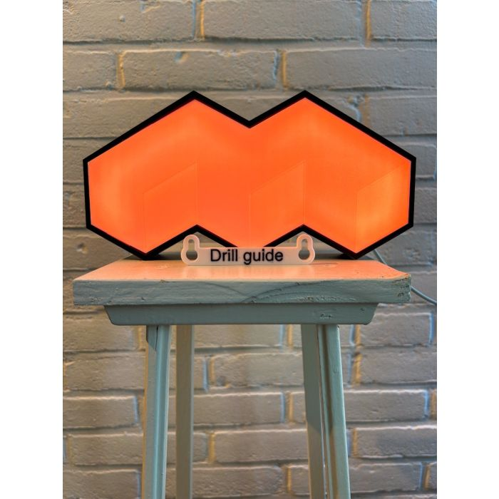

This project is originally based on the idea of the [Octolamp](https://github.com/martinwoodward/octolamp).

## Requirements

To build this light, you'll need access to a 3D printer, a soldering iron and the following components:

- Black PLA - For the base.
- White PLA - For the reflector and the outer body.
- WS2812B Led Strip, 60 LEDs pet meter, roughly 1 meter.
- ESP8266 or EPS32 D1 mini module.
- USB cable to connect the EPS to power.

There is a version available for single color and multicolor printers.

## Instructions

First, print the required parts. It is designed to be printable on most regular printers.

The 3 components are:

- [Black base](models/mage-os-light-black-base.stl)
- [White reflector](models/mage-os-light-reflector.stl)
- [White cover](models/mage-os-light-cover.stl)

Or, if you prefer the 3MF format:

- [Single color](models/mage-os-light-single-color.3mf)
- [Multi color](models/mage-os-light-multicolor.3mf)

The original model is also available: [mage-os-light.step](models/mage-os-light.step)

> [!NOTE]
> If you don't have a 3D printer available, or don't want to go through the hassle of ordering all the parts yourself, you can order one on [shop.magedispatch.com](https://shop.magedispatch.com/mage-os-light.html).

**Step 1 - Solder the ESP**

The LED strip usually comes with a connection piece. Take this piece and solder it the ESP as shown in the images below:

<table>
    <tr>
        <td>
            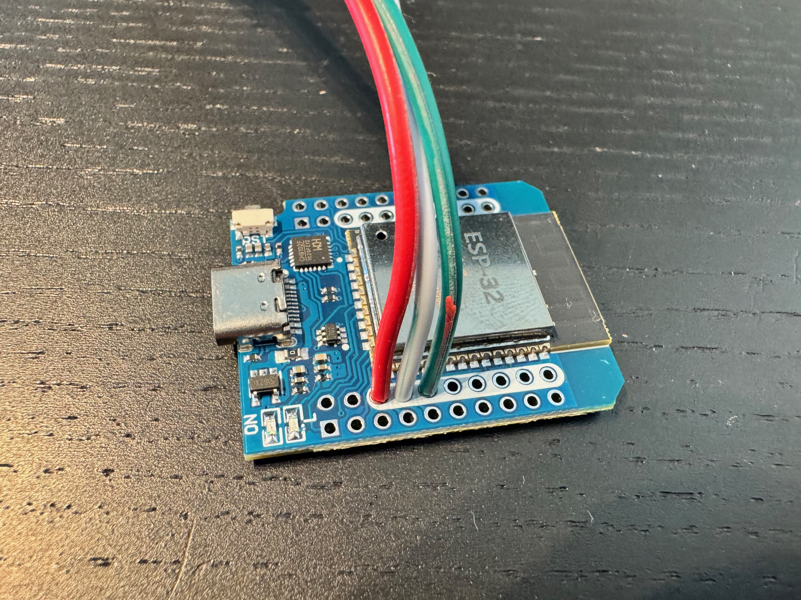
        </td>   
        <td>
            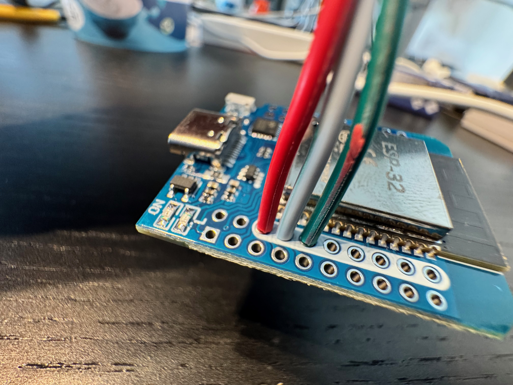
        </td>   
        <td>
            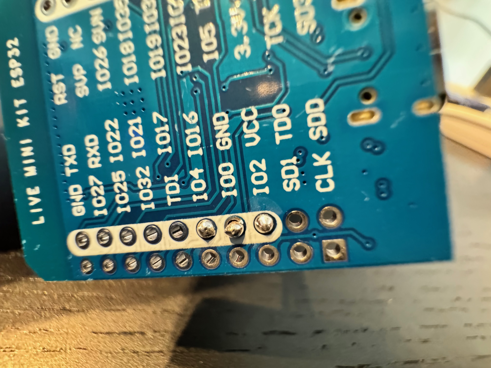
        </td>
    </tr>
</table>

**Step 2 - Install WLED**

Flash the ESP with WLED. The easiest method is to use the web-based installer at [https://install.wled.me/](https://install.wled.me/), which requires no additional software. Alternatively, you can manually flash the firmware - see the [WLED installation guide](https://kno.wled.ge/basics/install-binary/) for detailed instructions.

After flashing, configure your LED strip in the WLED web interface under Config → LED Preferences. Set the LED count to 38 (or your actual count) and configure the correct GPIO pin for your ESP board.

Make sure everything works as expected before continuing.

**Step 3 - Place the ESP in the black base**

Connect the ESP to your USB cable and place it in the black base:

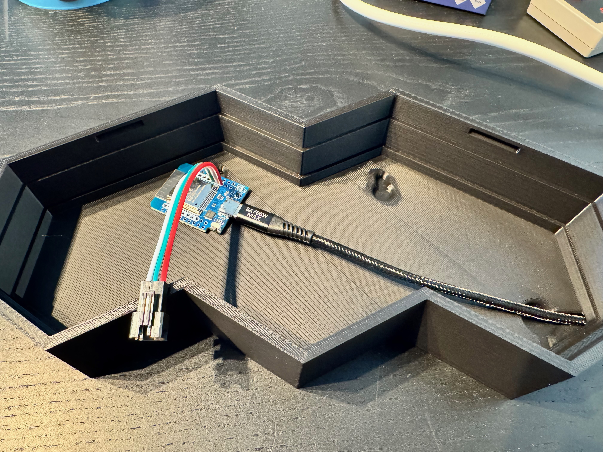

Pull the LED cable through the white reflector:

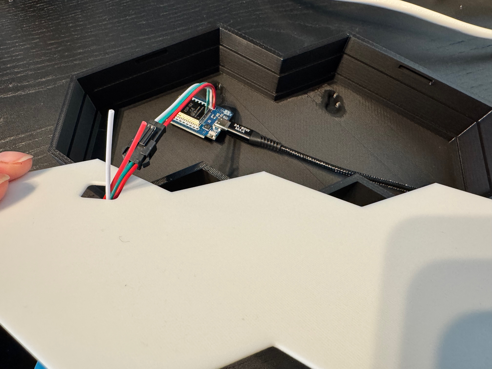
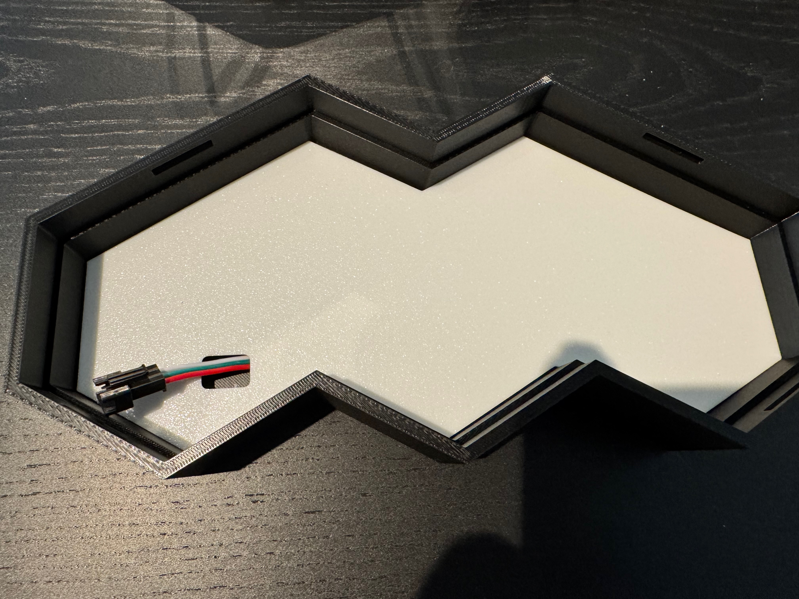

**Step 4 - Connect and place the LED strip**

Place the LED strip on to the base. Put as much cable as possible below the reflector for the best result. You can cut of the excessive LEDs

<table>
<tr>
<td>
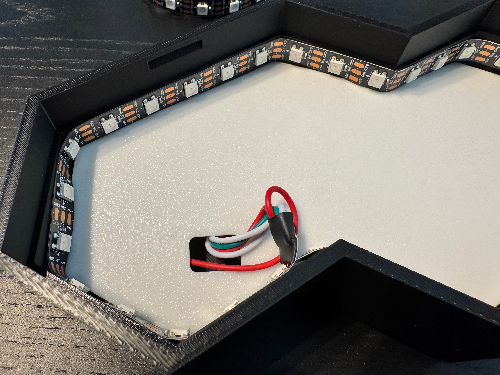
</td>
<td>
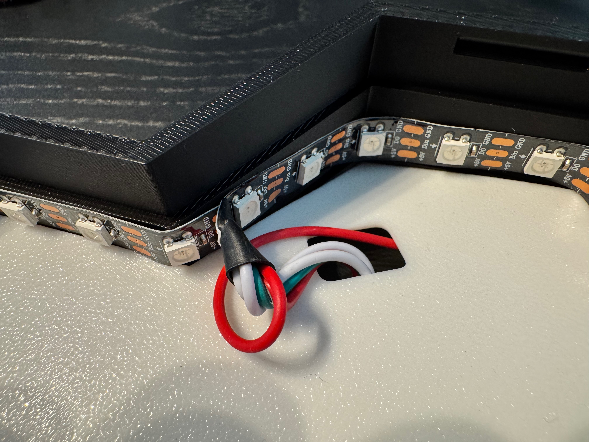
</td>
<td>
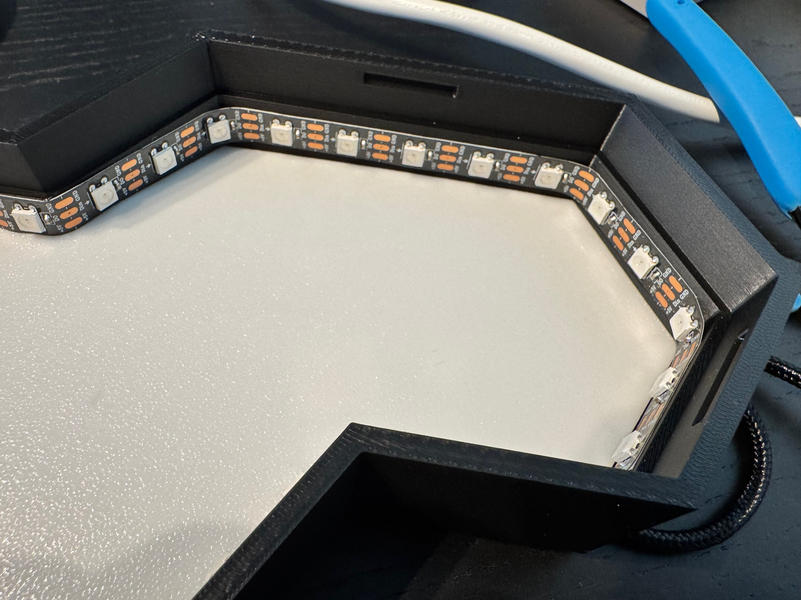
</td>
</tr>
</table>

After placing, test if everything works as expected:

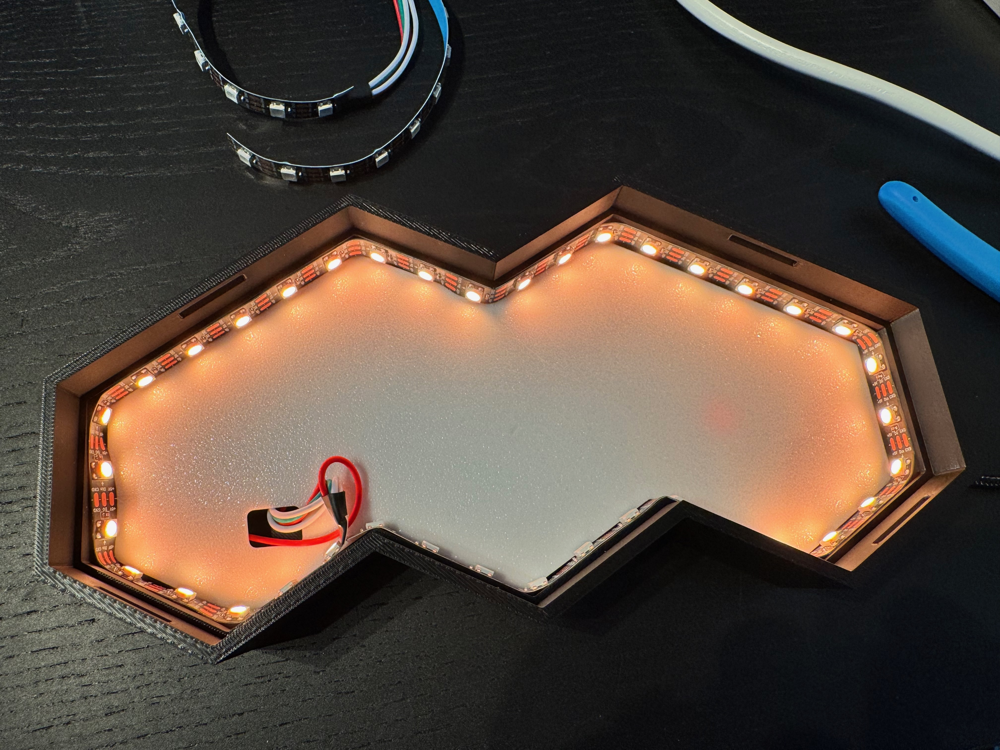

> [!NOTE]
> It might that not all LEDs are on. By default WLED only enables the first 30 LEDs. If you need to increase this amount go into the WLED web interface to Config -> LED Preferences and change the length to the correct number, usually 38:

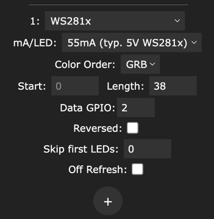

**Step 5 - Place the white outer body on top**

This can take a little force to push it in. It usually works best if you turn it upside down and push on the black base.

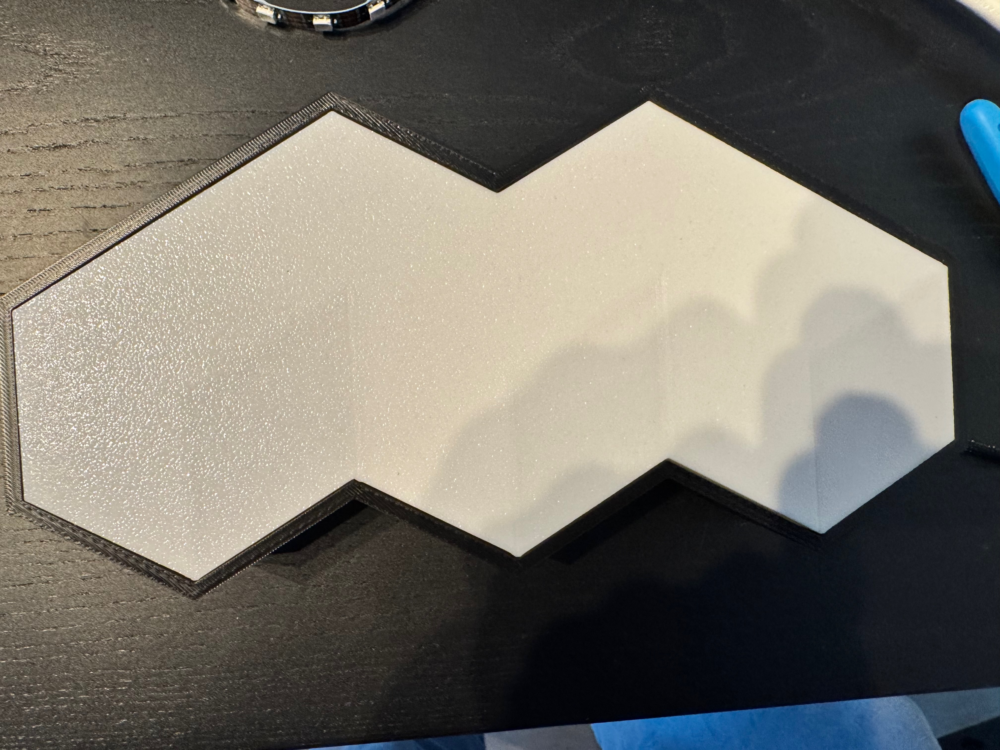